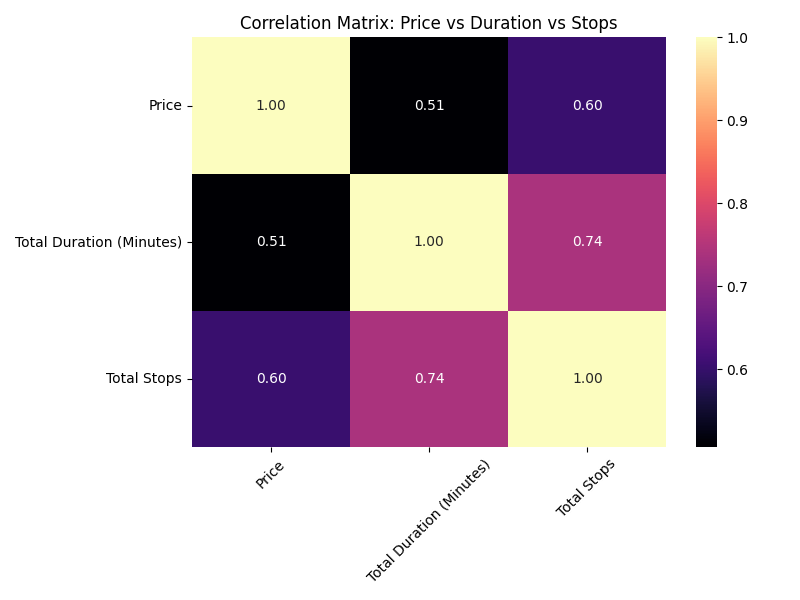
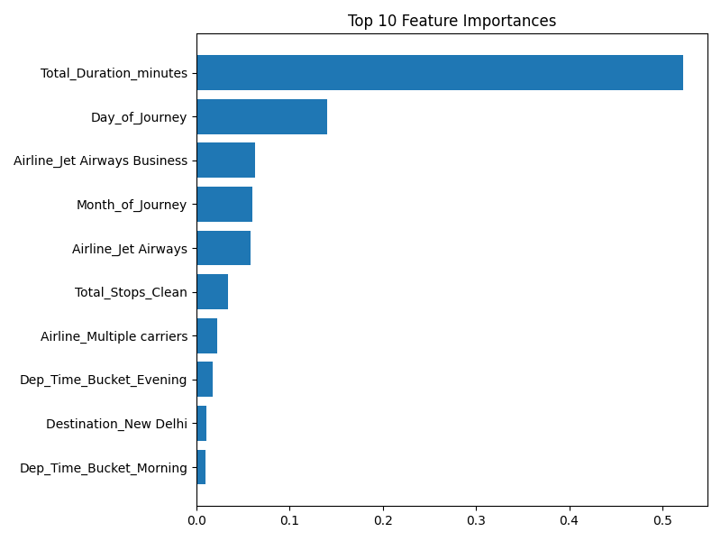
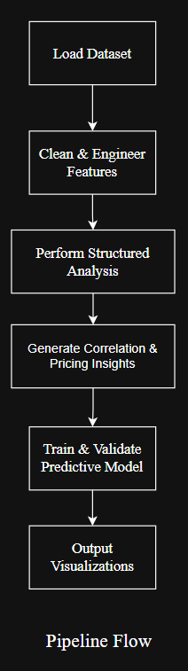

# ✈️ Airline Pricing Intelligence & Market Analytics Framework


---

## 📌 Executive Summary

This project analyzes airline ticket pricing behavior and builds a predictive pricing validation model using structured analytics and machine learning.

It demonstrates the ability to:

- Design a modular analytics pipeline  
- Perform structured EDA with business framing  
- Engineer predictive features from raw data  
- Translate pricing patterns into executive-level insights  
- Validate predictive performance using machine learning  

📄 **Full Executive Summary (Business Version):**    
👉 [View Executive Summary](docs/executive_summary.md)

---

## 🎯 Business Objective

To understand:

1. How flight structure (stops, duration, timing) impacts pricing  
2. Whether airlines price above or below route averages  
3. If premium brands consistently charge higher prices  
4. Whether structured features can predict airline ticket prices  

---

## 📊 Key Insights

### 1️⃣ Stops Drive Pricing More Than Duration

- Non-stop flights average: **₹5,024**
- 4-stop flights average: **₹17,686**
- Correlation with price:
  - Total Stops → **0.60**
  - Duration → **0.51**

Stops influence pricing more than total flight duration.

---

### 2️⃣ Brand Pricing Strategy Exists

- Premium carriers (Jet Airways Business, Vistara Premium) consistently price above route averages.
- Low-cost carriers (GoAir, SpiceJet) price below route averages.
- This confirms brand-driven pricing power independent of route structure.

---

### 3️⃣ Pricing Behavior Is Predictable

A Random Forest model was trained to validate structured pricing predictability.

#### Model Performance

- **R² Score:** 0.79  
- **MAE:** ₹1,279  

The model explains 79% of price variance using structured features.

#### Top Predictive Features

1. Total Duration (minutes)
2. Day of Journey
3. Airline (Brand effect)
4. Month of Journey
5. Total Stops

This suggests structured operational and brand features strongly influence price.

---

## 📊 Analytical Visualizations

### Correlation Analysis

This heatmap shows the relationship between price, number of stops, and total duration.

- Total Stops shows stronger correlation with Price than Duration  
- Stops and Duration are strongly correlated  



---

### Feature Importance (Random Forest)

This chart shows the most influential predictors in airline pricing.



---

## 🏗 Architecture Overview

The project follows a modular analytics pipeline design.

```
airline-pricing-intelligence/
│
├── data/                  # Raw dataset
├── docs/                  
|   ├── executive_summary.md    # Executive summary
|   └── pipeline-flow.png       # Pipeline Flow   
|
├── outputs/               # Generated visualizations
│   ├── CorrelationMap.png
│   └── feature_importance.png
│
├── src/
│   ├── data_loader.py     # Data ingestion
│   ├── preprocessing.py   # Feature engineering
│   ├── analysis.py        # Business insights & EDA
│   ├── model.py           # ML pipeline & validation
│   └── run_pipeline.py    # End-to-end execution
│
├── requirements.txt
└── README.md
```

---

## 🔍 Pipeline Flow



Run the entire pipeline:

```bash
python -m src.run_pipeline
```

---

## 🛠 Tech Stack

- Python  
- pandas  
- numpy  
- seaborn  
- matplotlib  
- scikit-learn  

---

## 📚 Dataset

- Size: ~518 KB  
- Records: 10,682 flights  
- Source: Structured airline pricing dataset  

---

## 💼 Business Impact

This framework demonstrates how structured pricing data can be used to:

- Identify premium vs discount airline positioning  
- Quantify brand-based pricing power  
- Understand how route structure affects fare dynamics  
- Predict expected market pricing with strong accuracy  

Such a system can support:

- Revenue optimization teams  
- Competitive pricing analysis  
- Route-level pricing strategy  
- Airline benchmarking dashboards  

---

## 🚀 What This Project Signals

- Structured analytical thinking  
- Modular Python architecture  
- Clean data transformation design  
- Business interpretation of model output  
- Pricing intelligence understanding  
- Ability to move from EDA → feature engineering → validation  

This is analytics engineering + business intelligence applied to pricing strategy.

---

## 👤 Author

**Prajwal Anand**  
Data Analytics | Pricing Intelligence | Machine Learning  

---

## 🔜 Future Enhancements

- Cross-validation implementation  
- Hyperparameter tuning  
- Time-series pricing trend modeling  
- Deployment-ready inference API

---
